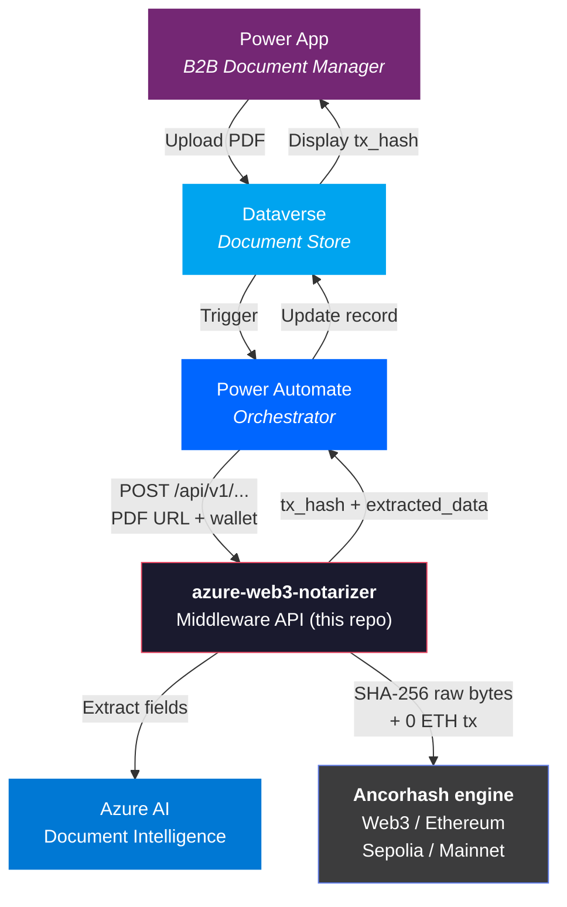

# azure-web3-notarizer

**API-first middleware bridging Azure AI Document Intelligence with the Ancorhash Web3 notarization engine.**

[](https://www.python.org/downloads/)
[](https://fastapi.tiangolo.com)
[](https://ethereum.org)
[](https://azure.microsoft.com/en-us/products/ai-services/ai-document-intelligence)
[]()
[]()

---

## What is this repository?

This repository is a **stateless, API-first middleware** that wires together two
independent building blocks of a larger product:

1. **Ancorhash** — our **proprietary Web3 notarization engine**. Ancorhash is the
   component that hashes the raw file bytes with SHA-256 and broadcasts an
   immutable, timestamped transaction on the **Ethereum blockchain**. Ancorhash
   *is* the cryptographic core: proof of existence, tamper detection,
   non-repudiation. Nothing more, nothing less.
2. **Azure AI Document Intelligence** — a commodity OCR / field-extraction
   service used to read structured data from PDFs (ISO 9001 certificates, audit
   reports, compliance records).

The code in this repo (`azure-web3-notarizer`) is **neither** of those two
things on its own. It is the **glue layer**: a thin, secure, async HTTP surface
that orchestrates Azure on one side and the Ancorhash engine on the other,
exposing them as atomic and composite REST endpoints.

```
                      ┌──────────────────────────────────┐
PDF URL ──▶ this API ─┤                                  │──▶ extracted_data
                      │  Azure AI Document Intelligence  │
                      └──────────────────────────────────┘
                      ┌──────────────────────────────────┐
PDF URL ──▶ this API ─┤   Ancorhash engine               │──▶ doc_hash + tx_hash
                      │   (SHA-256 raw bytes → Ethereum) │
                      └──────────────────────────────────┘
```

### The bigger picture: where this middleware lives

This middleware is designed to run **under the hood** of a future **Power App**
gestionale (commercial name TBD) targeted at the **Enterprise** market. That
Power App will live on **Dataverse**, manage document lifecycle, and delegate
both OCR and on-chain notarization to this API via Power Automate.

```
   ┌─────────────────────┐    ┌─────────────────────┐    ┌──────────────────────┐
   │  Power App + Data-  │───▶│  this middleware    │───▶│  Ancorhash engine    │
   │  verse (Frontend,   │    │  (azure-web3-       │    │  (Web3 / Ethereum)   │
   │   Enterprise B2B)   │    │   notarizer)        │    │                      │
   └─────────────────────┘    │                     │───▶│  Azure AI Doc Intel  │
                              └─────────────────────┘    └──────────────────────┘
        product surface             this repository           proprietary engine
                                                              + commodity OCR
```

The Power App is the **product the customer sees**. Ancorhash is the
**proprietary differentiator** that makes the product trustworthy. This
middleware is the **integration seam** that lets the two talk without
coupling.

## Design Philosophy

- **Strict separation of concerns.** Ancorhash is *not* this repo. Ancorhash is
  the Web3 engine. This repo is the API-first middleware that *uses* Ancorhash
  and *uses* Azure. Treat the boundaries as load-bearing — they are what makes
  the engine reusable in other surfaces beyond the future Power App.
- **API-first, not webhook-first.** Three orthogonal endpoints (`/notarize`,
  `/extract`, `/workflows/process-and-notarize`) so callers consume only what
  they need. The composite workflow is just sugar over the atomic ones.
- **Zero state.** No database. No cache. No queue. No filesystem writes. The
  middleware is a pure function: request in, response out. Persistence belongs
  to Dataverse upstream and to Ethereum downstream.
- **Azure is replaceable, Ancorhash is not.** OCR is a commodity choice; the
  Web3 anchor is the value. If a trade-off arises, the integrity of the
  Ancorhash side always wins.
- **Every component exists because it must.** No speculative abstractions, no
  hypothetical knobs.

---

## Architecture



### API Surface (API-first)

Three atomic endpoints, each protected by `X-API-Key`. Pick the one
that matches the operation you actually need — pay only for what you use.

```
POST /api/v1/notarize                       Download → SHA-256 → Ethereum
POST /api/v1/extract                        Download → Azure AI OCR
POST /api/v1/workflows/process-and-notarize Download → (Azure ∥ Web3)  ← composite
```

| Endpoint | Input | Calls Azure? | Calls Web3? | Returns |
|:---|:---|:---:|:---:|:---|
| `/api/v1/notarize` | `document_id`, `document_url`, `wallet_address` | no | yes | `status`, `doc_hash`, `tx_hash` |
| `/api/v1/extract` | `document_id`, `document_url` | yes | no | `status`, `extracted_data` |
| `/api/v1/workflows/process-and-notarize` | `document_id`, `document_url`, `wallet_address` | yes | yes | `status`, `doc_hash`, `tx_hash`, `extracted_data` |

### Pipeline Flow (composite workflow)

```
POST /api/v1/workflows/process-and-notarize
│
├─ Auth ─── X-API-Key header (constant-time comparison)
├─ Validate ─── Pydantic strict: document_id, document_url, wallet_address (EIP-55)
│
├─ Phase A ─── Download PDF (streaming, 10 MB cap, SSRF protection)
├─ Phase B ─── SHA-256 hash on raw file bytes (deterministic, Azure-independent)
├─ Phase C ∥ D ─── Azure AI Document Intelligence  ∥  Ethereum EIP-1559 tx
│                  (field extraction)              (0 ETH, hash in data field)
│                  └─── asyncio.gather (parallel) ───┘
│
└─ Response ─── { status, document_id, doc_hash, tx_hash, extracted_data }
```

### Technology Stack

| Layer | Technology | Purpose |
|:---|:---|:---|
| **Runtime** | Python 3.12+, FastAPI, Uvicorn | Async API server |
| **Validation** | Pydantic v2, Pydantic-Settings | Strict schema + secrets management (`SecretStr`) |
| **Blockchain** | Web3.py | EIP-1559 transactions, Sepolia & Mainnet |
| **Document AI** | Azure AI Document Intelligence | OCR & field extraction (prebuilt-layout) |
| **Resilience** | Tenacity, httpx | Exponential backoff, async streaming HTTP |
| **Security** | SSRF guard, streaming OOM protection | IP validation, chunked download with hard cap |

---

## Key Features

**Deterministic Notarization (powered by Ancorhash)** — The middleware delegates hashing and on-chain anchoring to the Ancorhash engine, which computes SHA-256 on the raw file bytes (never on extracted data). Same file, same hash, always — regardless of Azure or any intermediary.

**Zero-State Middleware** — No database, no Redis, no Celery, no filesystem writes. This API is a pure function: PDF URL in, structured response out. Persistence belongs to Dataverse upstream and to Ethereum (via Ancorhash) downstream.

**Security Hardened** — Secrets wrapped in `SecretStr` (never leaked in logs or tracebacks), SSRF protection on document URLs, streaming download with hard 10 MB cap, constant-time API key comparison.

**Microsoft Ecosystem Integration** — This middleware is built to run under the hood of a future Enterprise Power App on Dataverse, orchestrated by Power Automate. Power Automate calls the middleware, which fans out to Azure AI for OCR and to the Ancorhash engine for notarization, then returns a single structured payload for the Dataverse record.

**Blockchain Guarantees (via the Ancorhash engine)** — Each call to the notarization path produces an Ethereum transaction containing the document hash. This provides:
- **Proof of existence** — the document existed at the block timestamp
- **Integrity** — any modification produces a different hash
- **Non-repudiation** — the notarizer wallet cryptographically signed the transaction

---

## Quick Start

### 1. Clone & Install

```bash
git clone https://github.com/N0g4D/azure-web3-notarizer.git
cd azure-web3-notarizer

python3.12 -m venv .venv
source .venv/bin/activate
pip install -r requirements.txt
```

### 2. Configure

```bash
cp .env.example .env
```

| Variable | Description |
|:---|:---|
| `API_KEY` | Webhook authentication secret (shared with Power Automate) |
| `RPC_URL` | Ethereum JSON-RPC endpoint (Infura, Alchemy, etc.) |
| `PRIVATE_KEY` | Notarizer wallet private key (`0x` + 64 hex chars) |
| `AZURE_ENDPOINT` | Azure AI Document Intelligence endpoint |
| `AZURE_KEY` | Azure AI Document Intelligence API key |

> **Security.** The `.env` file is gitignored. All secrets are loaded via `pydantic-settings` and wrapped in `SecretStr` — they never appear in logs, error messages, or HTTP responses.

### 3. Run

```bash
uvicorn app.main:app --reload
```

| Endpoint | Method | Description |
|:---|:---|:---|
| `/api/v1/notarize` | `POST` | Atomic: download + SHA-256 + Ethereum notarization (no Azure) |
| `/api/v1/extract` | `POST` | Atomic: download + Azure AI field extraction (no Web3) |
| `/api/v1/workflows/process-and-notarize` | `POST` | Composite workflow: parallel Azure ∥ Web3 |
| `/health` | `GET` | Liveness probe |
| `/docs` | `GET` | Interactive API documentation (Swagger UI) |

### 4. Test

```bash
pytest tests/ -v
```

All 15 tests are fully isolated — no real calls to Azure or Ethereum.

---

## Project Structure

```
app/
├── api/
│   ├── dependencies.py         # API Key auth (X-API-Key, constant-time)
│   └── v1/
│       └── endpoints.py        # POST /notarize, /extract, /workflows/process-and-notarize
├── core/
│   ├── config.py               # Pydantic BaseSettings + SecretStr + validators
│   └── logger.py               # Structured JSON logging
├── models/
│   └── schemas.py              # NotarizeRequest, ExtractRequest, FullProcessRequest (+ responses)
├── services/
│   ├── azure_client.py         # SSRF-safe PDF download + Azure AI extraction
│   └── web3_client.py          # SHA-256 hashing + Ethereum notarization
└── main.py                     # FastAPI entrypoint

tests/
├── conftest.py                 # Fixtures: fake env, async client, valid payloads
└── test_endpoints.py           # 15 tests: auth, validation, SSRF, OOM, atomic + workflow happy paths

docs/
├── ARCHITECTURE.md             # System architecture + ISV roadmap
└── SANITIZATION_TODO.md        # Security hardening checklist
```

---

## Security

| Measure | Implementation |
|:---|:---|
| **Secret management** | `SecretStr` for all keys — `repr()` returns `'**********'` |
| **Auth** | `X-API-Key` header with `secrets.compare_digest` (constant-time) |
| **SSRF protection** | HTTPS-only, DNS resolution against private/loopback IPs |
| **OOM protection** | Streaming download with 64 KB chunks, hard abort at 10 MB |
| **Input validation** | Pydantic strict mode, EIP-55 checksum, URL scheme enforcement |
| **Log safety** | No `traceback.format_exc()`, error messages truncated, no secrets in output |

---

## Roadmap

The product is built in three distinct layers — engine, middleware, frontend —
and this repository is only the middle one.

| Layer | Component | Status | Description |
|:---|:---|:---|:---|
| **Engine** | **Ancorhash** (Web3 notarization) | Done | Proprietary core: SHA-256 on raw bytes + EIP-1559 transaction on Ethereum (Sepolia validated, Mainnet ready). Lives inside `app/services/web3_client.py` of this repo today, designed to be reusable from any surface. |
| **Middleware** | `azure-web3-notarizer` (this repo) | Done | API-first FastAPI bridge between Ancorhash and Azure AI Document Intelligence. Atomic + composite endpoints, security hardened, 15 tests. |
| **Frontend** | Enterprise Power App on Dataverse (name TBD) | Next | B2B document manager: upload PDF, store metadata in Dataverse, call this middleware via Power Automate, persist `doc_hash` + `tx_hash` on the record. Target: Enterprise market. |
| **Go-to-market** | Microsoft ISV Success submission | Planned | Submit the full vertical (Power App + Dataverse + this middleware + Ancorhash engine) to the Microsoft ISV Success Program. |

---

## How It Works (for Verifiers)

To verify a document against its on-chain notarization:

```bash
# 1. Compute the SHA-256 of the original file
shasum -a 256 document.pdf
# Output: b9746dbcf29ac147e8fa056fbba5f3a667be2e34c559cd139d62d8915d51c140

# 2. Look up the Ethereum transaction on Etherscan
# The 'Input Data' field contains: 0x + the same hash

# 3. If they match → the document is authentic and unmodified
#    If they don't → the document has been tampered with
```

---

## License

Proprietary. All rights reserved.

---

<p align="center">
  <b>azure-web3-notarizer</b> — the API-first middleware powered by the <b>Ancorhash</b> Web3 engine.
</p>
