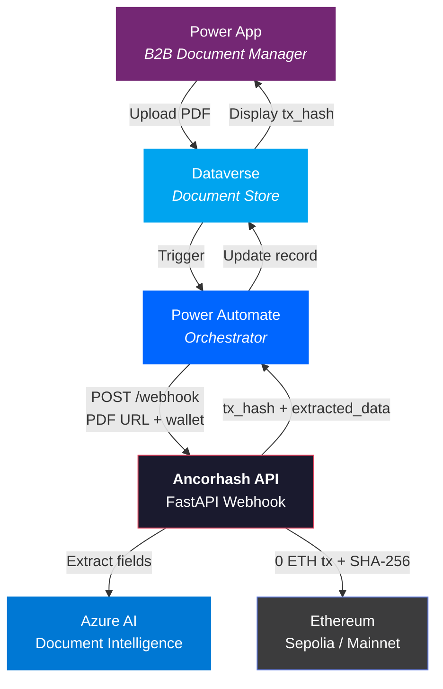

# Ancorhash

**Immutable document notarization on Ethereum for B2B compliance.**

[](https://www.python.org/downloads/)
[](https://fastapi.tiangolo.com)
[](https://ethereum.org)
[](https://azure.microsoft.com/en-us/products/ai-services/ai-document-intelligence)
[]()
[]()

---

## What is Ancorhash?

Ancorhash is a **stateless API** that certifies the existence and integrity of business documents (ISO 9001 certificates, audit reports, compliance records) by anchoring their SHA-256 fingerprint on the **Ethereum blockchain**.

A single API call takes a PDF, computes its cryptographic hash on the raw file bytes, and broadcasts an immutable, timestamped transaction on Ethereum — providing **proof of existence**, **tamper detection**, and **non-repudiation** without any database or intermediary.

```
PDF in  -->  SHA-256 on raw bytes  -->  Ethereum transaction  -->  tx_hash out
```

> **Design philosophy.** No database. No cache. No queue. No frontend.
> One request in, one transaction out. Every component exists because it must.

---

## Architecture



### Pipeline Flow

```
POST /api/v1/documents/webhook
│
├─ Auth ─── X-API-Key header (constant-time comparison)
├─ Validate ─── Pydantic strict: document_id, document_url, wallet_address (EIP-55)
│
├─ Phase A ─── Download PDF (streaming, 10 MB cap, SSRF protection)
├─ Phase B ─── SHA-256 hash on raw file bytes (deterministic, Azure-independent)
├─ Phase C ─── Azure AI Document Intelligence (field extraction, key-value pairs)
├─ Phase D ─── Ethereum EIP-1559 transaction (0 ETH, hash in data field)
│
└─ Response ─── { status, document_id, doc_hash, tx_hash, extracted_data }
```

### Technology Stack

| Layer | Technology | Purpose |
|:---|:---|:---|
| **Runtime** | Python 3.12+, FastAPI, Uvicorn | Async API server |
| **Validation** | Pydantic v2, Pydantic-Settings | Strict schema + secrets management (`SecretStr`) |
| **Blockchain** | Web3.py | EIP-1559 transactions, Sepolia & Mainnet |
| **Document AI** | Azure AI Document Intelligence | OCR & field extraction (prebuilt-layout) |
| **Resilience** | Tenacity, httpx | Exponential backoff, async streaming HTTP |
| **Security** | SSRF guard, streaming OOM protection | IP validation, chunked download with hard cap |

---

## Key Features

**Deterministic Notarization** — The SHA-256 hash is computed on the raw file bytes, not on extracted data. Same file, same hash, always — regardless of Azure or any intermediary.

**Zero-State Architecture** — No database, no Redis, no Celery, no filesystem writes. The API is a pure function: PDF in, transaction hash out.

**Security Hardened** — Secrets wrapped in `SecretStr` (never leaked in logs or tracebacks), SSRF protection on document URLs, streaming download with hard 10 MB cap, constant-time API key comparison.

**Microsoft Ecosystem Integration** — Built to operate as an invisible engine under Power Apps + Dataverse, orchestrated by Power Automate. The API receives calls from Power Automate and returns structured data for Dataverse records.

**Blockchain Guarantees** — Each notarization produces an Ethereum transaction containing the document hash. This provides:
- **Proof of existence** — the document existed at the block timestamp
- **Integrity** — any modification produces a different hash
- **Non-repudiation** — the notarizer wallet cryptographically signed the transaction

---

## Quick Start

### 1. Clone & Install

```bash
git clone https://github.com/N0g4D/azure-web3-notarizer.git
cd azure-web3-notarizer

python3.12 -m venv .venv
source .venv/bin/activate
pip install -r requirements.txt
```

### 2. Configure

```bash
cp .env.example .env
```

| Variable | Description |
|:---|:---|
| `API_KEY` | Webhook authentication secret (shared with Power Automate) |
| `RPC_URL` | Ethereum JSON-RPC endpoint (Infura, Alchemy, etc.) |
| `PRIVATE_KEY` | Notarizer wallet private key (`0x` + 64 hex chars) |
| `AZURE_ENDPOINT` | Azure AI Document Intelligence endpoint |
| `AZURE_KEY` | Azure AI Document Intelligence API key |

> **Security.** The `.env` file is gitignored. All secrets are loaded via `pydantic-settings` and wrapped in `SecretStr` — they never appear in logs, error messages, or HTTP responses.

### 3. Run

```bash
uvicorn app.main:app --reload
```

| Endpoint | Method | Description |
|:---|:---|:---|
| `/api/v1/documents/webhook` | `POST` | Main notarization webhook |
| `/health` | `GET` | Liveness probe |
| `/docs` | `GET` | Interactive API documentation (Swagger UI) |

### 4. Test

```bash
pytest tests/ -v
```

All 12 tests are fully isolated — no real calls to Azure or Ethereum.

---

## Project Structure

```
app/
├── api/
│   ├── dependencies.py         # API Key auth (X-API-Key, constant-time)
│   └── v1/
│       └── endpoints.py        # POST /api/v1/documents/webhook
├── core/
│   ├── config.py               # Pydantic BaseSettings + SecretStr + validators
│   └── logger.py               # Structured JSON logging
├── models/
│   └── schemas.py              # WebhookPayload with EIP-55 validation
├── services/
│   ├── azure_client.py         # SSRF-safe PDF download + Azure AI extraction
│   └── web3_client.py          # SHA-256 hashing + Ethereum notarization
└── main.py                     # FastAPI entrypoint

tests/
├── conftest.py                 # Fixtures: fake env, async client, valid payloads
└── test_webhook.py             # 12 tests: auth, validation, SSRF, OOM, happy path

docs/
├── ARCHITECTURE.md             # System architecture + ISV roadmap
└── SANITIZATION_TODO.md        # Security hardening checklist
```

---

## Security

| Measure | Implementation |
|:---|:---|
| **Secret management** | `SecretStr` for all keys — `repr()` returns `'**********'` |
| **Auth** | `X-API-Key` header with `secrets.compare_digest` (constant-time) |
| **SSRF protection** | HTTPS-only, DNS resolution against private/loopback IPs |
| **OOM protection** | Streaming download with 64 KB chunks, hard abort at 10 MB |
| **Input validation** | Pydantic strict mode, EIP-55 checksum, URL scheme enforcement |
| **Log safety** | No `traceback.format_exc()`, error messages truncated, no secrets in output |

---

## Roadmap

| Phase | Status | Description |
|:---|:---|:---|
| **Backend API** | Done | FastAPI webhook — E2E notarization on Sepolia, security hardened, 12 tests |
| **Power App** | Next | B2B document manager on Power Apps + Dataverse. Upload PDF, store metadata, display `tx_hash` |
| **ISV Submission** | Planned | Submit the full solution (Power App + Dataverse + Ancorhash) to the Microsoft ISV Success Program |

---

## How It Works (for Verifiers)

To verify a document against its on-chain notarization:

```bash
# 1. Compute the SHA-256 of the original file
shasum -a 256 document.pdf
# Output: b9746dbcf29ac147e8fa056fbba5f3a667be2e34c559cd139d62d8915d51c140

# 2. Look up the Ethereum transaction on Etherscan
# The 'Input Data' field contains: 0x + the same hash

# 3. If they match → the document is authentic and unmodified
#    If they don't → the document has been tampered with
```

---

## License

Proprietary. All rights reserved.

---

<p align="center">
  <b>Ancorhash</b> — Blockchain-certified trust for B2B documents.
</p>
