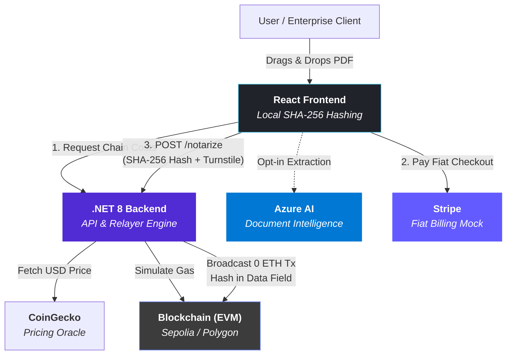
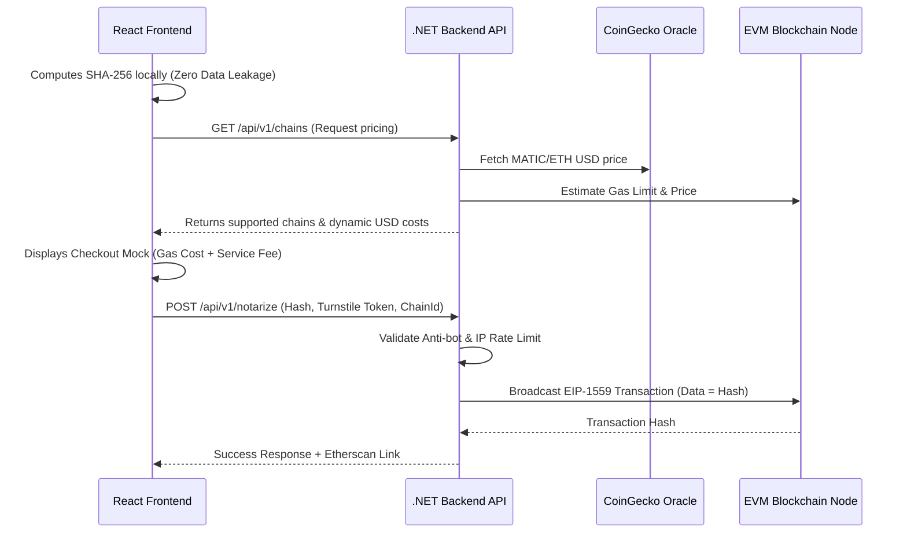

# Ancorhash

**Enterprise Web3 Document Notarization platform. Zero Data Leakage, Gas-Sponsored, Fiat-Ready.**

[](https://dotnet.microsoft.com/)
[](https://reactjs.org/)
[](https://ethereum.org)
[](https://azure.microsoft.com/en-us/products/ai-services/ai-document-intelligence)

---

## What is Ancorhash?

Ancorhash is a B2B SaaS platform designed to bring cryptographic proof of existence and data integrity to the Enterprise world (Banks, Healthcare, Public Administration) without the compliance and UX hurdles typical of Web3 applications.

Ancorhash allows users to timestamp and notarize documents on EVM-compatible blockchains (Ethereum, Polygon) providing mathematical certainty that a document existed at a specific time and has not been altered since. 

### The Enterprise Differentiators
1. **Zero Data Leakage:** Due to GDPR and corporate compliance, sensitive documents (contracts, medical records) cannot be uploaded to third-party cloud services. Ancorhash computes the SHA-256 cryptographic hash of the file **locally inside the user's browser**. Only the 32-byte hash is sent to the backend. The document never leaves the user's device.
2. **Gas-Sponsored Relayer:** Corporate clients cannot manage crypto wallets, private keys, or hold volatile cryptocurrencies on their balance sheets. Ancorhash uses a Relayer architecture: the backend signs and pays for the blockchain transaction (Gas) on behalf of the user.
3. **Fiat Billing (Stripe-Ready):** Users pay a predictable, standard fiat fee (e.g., in USD/EUR) via credit card for the service. The backend orchestrates a real-time decentralized pricing oracle to calculate the gas cost and applies a fixed service markup.

---

## System Architecture

The V2 architecture separates the local hashing and intelligence layer from the Web3 transactional layer, ensuring complete data privacy.


```mermaid
graph TB
    USER["User / Enterprise Client"]
    BROWSER["<b>React Frontend</b><br/><i>Local SHA-256 Hashing</i>"]
    API["<b>.NET 8 Backend</b><br/><i>API & Relayer Engine</i>"]
    AZURE["<b>Azure AI</b><br/><i>Document Intelligence</i>"]
    STRIPE["<b>Stripe</b><br/><i>Fiat Billing Mock</i>"]
    ORACLE["<b>CoinGecko</b><br/><i>Pricing Oracle</i>"]
    ETH["<b>Blockchain (EVM)</b><br/><i>Sepolia / Polygon</i>"]

    USER -->|"Drags & Drops PDF"| BROWSER
    BROWSER -.->|"Opt-in Extraction"| AZURE
    BROWSER -->|"1. Request Chain Costs"| API
    API -->|"Fetch USD Price"| ORACLE
    API -->|"Simulate Gas"| ETH
    BROWSER -->|"2. Pay Fiat Checkout"| STRIPE
    BROWSER -->|"3. POST /notarize<br/>(SHA-256 Hash + Turnstile)"| API
    API -->|"Broadcast 0 ETH Tx<br/>Hash in Data Field"| ETH

    style BROWSER fill:#20232a,stroke:#61dafb,color:#fff
    style API fill:#512bd4,stroke:#512bd4,color:#fff
    style ETH fill:#3C3C3D,stroke:#627EEA,color:#fff
    style AZURE fill:#0078D4,stroke:#0078D4,color:#fff
    style STRIPE fill:#635bff,stroke:#635bff,color:#fff
```

### The Notarization Flow (Sequence)


```mermaid
sequenceDiagram
    participant B as React Frontend
    participant A as .NET Backend API
    participant O as CoinGecko Oracle
    participant R as EVM Blockchain Node
    
    B->>B: Computes SHA-256 locally (Zero Data Leakage)
    B->>A: GET /api/v1/chains (Request pricing)
    A->>O: Fetch MATIC/ETH USD price
    A->>R: Estimate Gas Limit & Price
    A-->>B: Returns supported chains & dynamic USD costs
    B->>B: Displays Checkout Mock (Gas Cost + Service Fee)
    B->>A: POST /api/v1/notarize (Hash, Turnstile Token, ChainId)
    A->>A: Validate Anti-bot & IP Rate Limit
    A->>R: Broadcast EIP-1559 Transaction (Data = Hash)
    R-->>A: Transaction Hash
    A-->>B: Success Response + Etherscan Link
```

---

## Technology Stack

### Backend (`src/Ancorhash.Api` / `Core` / `Infrastructure`)
Built with **C# .NET 8 (Isolated Azure Functions)** for maximum scalability and serverless execution.
- **Blockchain:** `Nethereum` for RPC interactions and EIP-1559 transaction building.
- **Security:** `Cloudflare Turnstile` server-side validation and custom IP-based `RateLimitingMiddleware` using `IMemoryCache` to prevent wallet draining.
- **Pricing Oracle:** Real-time fiat conversion via `CoinGecko` API, heavily cached and designed to fail-soft (fallback to $0) in case of rate limits.
- **Observability:** `OpenTelemetry` configured for Enterprise-grade logging.

### Frontend (`src/Ancorhash.Web`)
Built with **React, TypeScript, Vite, and Tailwind CSS**.
- **Local Hashing:** Fast, memory-safe client-side SHA-256 generation using `crypto.subtle`.
- **UI/UX:** Minimalist, monochromatic design optimized for B2B dashboards. Includes a Mock Checkout interface for live product demonstrations.
- **Anti-bot:** `@marsidev/react-turnstile` integrated seamlessly into the submission flow.

---

## Local Development Setup

### Prerequisites
- Node.js 20+
- .NET 8 SDK
- Azure Functions Core Tools (`func`)

### 1. Backend Setup
Navigate to the API project and restore dependencies:
```bash
cd src/Ancorhash.Api
dotnet restore
```
Create a `local.settings.json` file. Ensure you configure a valid Relayer Private Key (with funds on the selected networks) and standard RPC URLs:
```json
{
  "IsEncrypted": false,
  "Values": {
    "FUNCTIONS_WORKER_RUNTIME": "dotnet-isolated",
    "Logging__LogLevel__Default": "Information",
    "Evm__RelayerPrivateKey": "0xYOUR_PRIVATE_KEY",
    "Turnstile__SecretKey": "1x0000000000000000000000000000000AA",
    "Blockchain__Networks__11155111__RpcUrl": "https://sepolia.infura.io/v3/...",
    "Blockchain__Networks__11155111__Name": "Ethereum Sepolia",
    "Blockchain__Networks__11155111__NativeCoinId": "ethereum",
    "Blockchain__Networks__11155111__IsTestnet": "true"
  },
  "Host": {
    "CORS": "http://localhost:5173",
    "CORSCredentials": false
  }
}
```
Run the backend:
```bash
dotnet run
```

### 2. Frontend Setup
In a new terminal, navigate to the Web project:
```bash
cd src/Ancorhash.Web
npm install
```
Create a `.env` file for the Turnstile public test key:
```env
VITE_TURNSTILE_SITEKEY="1x00000000000000000000AA"
```
Start the Vite development server:
```bash
npm run dev
```
Open `http://localhost:5173` in your browser.

---

## Security & Protections

Since Ancorhash pays the transaction fees, the `/api/v1/notarize` endpoint is a highly critical surface. It is protected by a multi-layered defense strategy:
1. **IP Rate Limiting:** Discards requests aggressively at the middleware layer if an IP exceeds the allowed threshold (HTTP 429), saving CPU and API calls.
2. **Cloudflare Turnstile:** Blocks headless browsers and automated scripts via cryptographic challenges (HTTP 403).
3. **Fail-Safe Orchestration:** Any failure in the RPC nodes or pricing oracles is caught, logged via OpenTelemetry, and handled gracefully without crashing the host process.

---

## Historical Note: The V1 PoC
Ancorhash originally started as a Python 3.12+ and FastAPI project (`azure-web3-notarizer`)[cite: 1]. That initial proof-of-concept acted as a pure API-first middleware[cite: 1]. However, it relied on downloading the actual PDF payload to the server for processing[cite: 1]. To meet stringent Enterprise data privacy requirements, the architecture was entirely reimagined and rewritten in .NET and React (V2) to achieve true Zero Data Leakage.

---
<p align="center">
  <b>Ancorhash</b> — Trust through Cryptography.
</p>